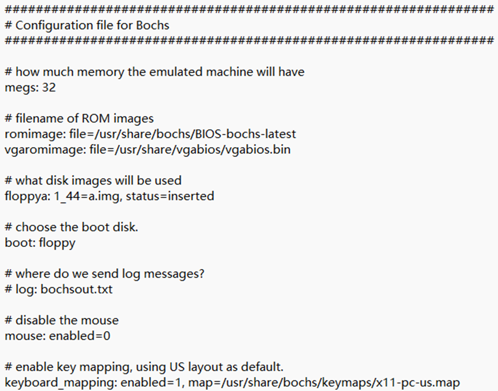

# 实验任务

# 预备知识

- X86的保护模式知识（课件“Intel内存管理”节 + 教材7.8节 + 百度“保护模式”）
- Bochs虚拟机使用（回顾实验1.1）
- NASM汇编（回顾实验1.1）
- 编程实践和指南：于渊《自己动手写操作系统》前3章

# 开发和运行环境的配置

开发与运行环境：

- Ubuntu 18.04.6 LTS
- Bochs x86 Emulator 2.6
- NASM version 2.13.02

开发与运行环境的配置过程：

Bochs 是一个开源的 x86 模拟器，可以用于模拟具有 Intel x86 架构的计算机。它允许用户在虚拟环境中运行操作系统和应用程序，而无需在物理硬件上进行安装。

从Bochs官方网站下载源代码：https://bochs.sourceforge.io/

然后解压缩，运行 configure 脚本，用于配置 Bochs 的编译选项，使用--enable-debugger 选项启用调试器支持，使用--enable-disasm 选项启用反汇编器支持。

使用 Makefile 编译 Bochs 的源代码，生成可执行文件。

将编译生成的 Bochs 可执行文件安装到系统中。使用 sudo 命令以管理员权限进行安装，这样可以将文件复制到系统路径中，以便在任何地方都可以执行 Bochs。

根据给出的参考资料，使用bximage等命令，创建一个软盘映像：

完成这一步骤之后，当前目录下就多了一个a.img文件。该文件就是生成的软盘映像。

使用dd命令将引导扇区写进软盘：

配置Bochs的配置文件，明确Bochs虚拟机所需要的内存大小，以及硬盘映像和软盘映像都是哪些文件等内容。将配置文件命名为：bochsrc

一切准备就绪，在命令行中输入bochs启动Bochs虚拟机。

出现黑屏的图形化界面之后，在原本的命令行中输入字符“c”回车，即可看到正常的Bochs虚拟机画面，如下图所示：

至此，Bochs已经成功安装到了Ubuntu虚拟机中。

NASM（Netwide Assembler）是一种汇编语言编译器，用于将汇编语言源代码转换为可执行的机器代码。与其他汇编器类似，NASM 将汇编语言代码转换为目标系统的机器码，因此可以在各种 x86 平台上运行。

使用包管理器安装NASM，或者手动下载源代码并编译安装：

至此，本次课设需要的所有环境全部搭建完成。

# 运行和测试过程

本次实验我完成了四个实验任务，由于四个实验任务的配置过程非常相似，故不再赘述。详情见环境配置有关章节。

## 实验一

使用命令：nasm qyf.asm -o qyf.com将 qyf.asm 中的汇编代码编译成可执行的 .com 格式文件，并将生成的可执行文件保存为 qyf.com。

使用Linux 下的挂载命令mount -o loop pm.img /mnt/floppy，将文件系统连接到指定的挂载点。其中-o loop: 是挂载选项，它告诉 mount 命令使用循环设备来挂载文件。循环设备是一种虚拟设备，可以将文件视为块设备进行挂载。这个命令的作用是将 pm.img 文件挂载到 /mnt/floppy 目录下，以便访问其中的内容，就好像它是一个磁盘驱动器一样。

使用命令cp qyf.com /mnt/floppy/，将 qyf.com 文件复制到 /mnt/floppy/ 目录下，以便在该目录中能够访问这个文件。如果/mnt/floppy/ 目录不存在则直接自己创建一个。

使用命令umount /mnt/floppy卸载之前挂载到 /mnt/floppy 目录下的文件系统或者设备，这样就断开了与 pm.img 文件之间的关联，使得该目录再次成为一个普通的目录，而不再表示一个挂载点。

然后直接启动Bochs虚拟机，在命令行中输入字符c然后回车。在Bochs虚拟机界面中输入b:\qyf.com就可以运行我们编写的代码了。

效果如下图所示：

在这段代码中，字符‘1’、‘2’和‘3’是在不同的特权级下输出的：

- 字符‘1’是在保护模式下输出的。在 [SECTION .sdest] 中，通过调用门跳转到一个特权级更高的非一致代码段，这个代码段中输出了字符‘1’。
- 字符‘2’是在局部任务中输出的，而局部任务是在局部描述符表 (LDT) 中定义的。在 [SECTION .la] 中，通过跳转到局部描述符表中的代码段，输出了字符‘2’。
- 字符 '3' 是在保护模式下的非一致代码段中输出的。在 [SECTION .ring3] 中，通过调用测试调用门指令，再通过调用门跳转到一个非一致代码段，输出了字符 '3'。

## 实验二

前面的编译和运行步骤与实验一类似，不再赘述。

与实验一类似，在实验二中主要完成了以下事情：

- 初始化全局描述符表（GDT），包括描述符的定义和选择子的设置。
- 初始化数据段、代码段和堆栈段的描述符。
- 开启分页机制并设置页目录和页表。
- 显示一些信息，比如内存检测结果和RAM大小。
- 进行分页机制的演示，包括切换页目录和测试分页效果。
- 最后返回到实模式，并通过中断 21h 返回到 DOS 环境。

运行结果如下所示：

输出的内容包括：

1. 进入保护模式后显示的字符串 "In Protect Mode now. ^-^"。
2. 显示内存检测的标题和结果，包括每个内存段的基地址、长度和类型。
3. 显示 RAM 的大小。
4. 显示 "HUST" 和 "MrSu" 字样在屏幕上。

在这段代码中，"HUST" 和 "MrSu" 字样是通过在屏幕上直接写入字符来实现的。具体的输出过程是在32位保护模式下进行的。

首先，通过 call SetupPaging 启动了分页机制，该过程在32位保护模式下执行。分页机制的启动是通过设置页目录和页表来实现的，这样系统就能够使用虚拟地址空间了。

接着，调用 call PagingDemo 进行分页机制的演示。在这个过程中，可能会涉及到页表的切换等操作，但总体来说，仍然是在32位保护模式下执行。

最后，在 PagingDemo 过程中，调用了 call SelectorFlatC:ProcPagingDemo 来执行 ProcPagingDemo 这个过程。这个过程中包含了输出 "HUST" 和 "MrSu" 字样的操作。

在 ProcPagingDemo 这个过程中，通过设置段寄存器和使用相应的段选择子，将数据段选择为 SelectorData，将视频段选择为 SelectorVideo。然后，通过直接在视频段内存中写入字符来在屏幕上显示内容。

## 实验三

前面的编译和运行步骤与实验一类似，不再赘述。

在Bochs虚拟机中的运行qyf.com,得到如下所示结果：

可以看到输出字符 "HUST" 和 "MrSu" 在屏幕上来回交替显示。

程序进入保护模式后显示字符串 "It is Protect Mode now."，然后会显示内存信息表。内存信息表包括标题 "BaseAddrL BaseAddrH LengthLow LengthHigh Type"，以及一系列内存地址和长度信息。

程序会将代码段复制到指定的线性地址，并且设置分页机制，同时进行中断初始化，并打开中断。

通过任务切换，程序会循环输出字符串 "HUST " 和 "MRSU "，由于两个任务在死循环中相互切换，输出会交替出现。

## 实验四

前面的编译和运行步骤与实验一类似，不再赘述。

在Bochs虚拟机中的运行qyf.com,得到如下所示结果：

这段代码实现了一个基于保护模式的简单操作系统。首先，进入保护模式后，系统会显示相应的提示信息，同时还会展示内存信息表以及其他必要的初始化信息。接着，程序会按照给定的优先级（16, 10, 8, 6）创建四个任务，每个任务以死循环的形式分别输出不同的字符串：VARY、LOVE、HUST、MRSU。其中可以观察到VERY显示时间最长，MRSU最短，LOVE，HUST居中。

这些任务的优先级差异体现在它们持续显示字符串的时间长度上，优先级较高的任务会更频繁地执行，因此其输出的字符串会在屏幕上停留更长的时间。整体上，这个简单的操作系统考虑到了任务的优先级，并通过任务切换实现了多任务并发执行。
